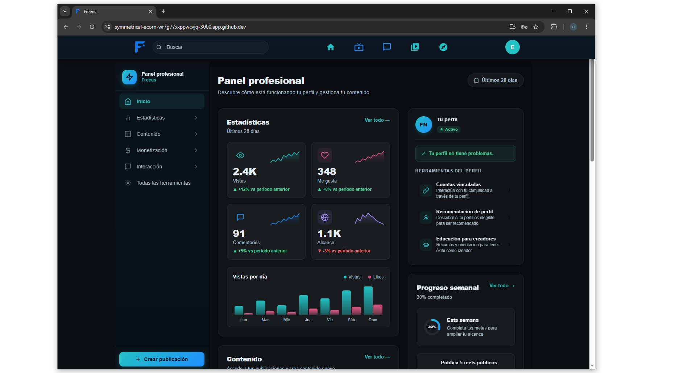
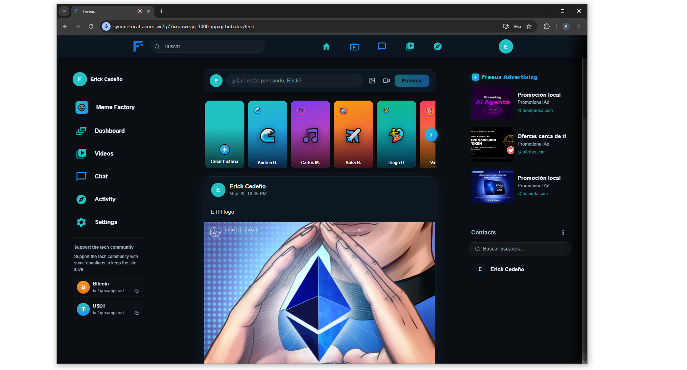
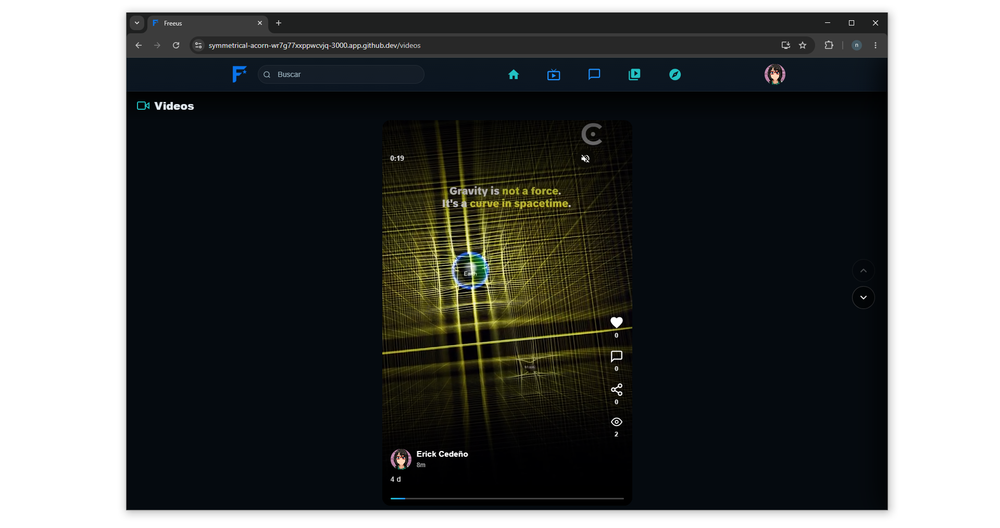
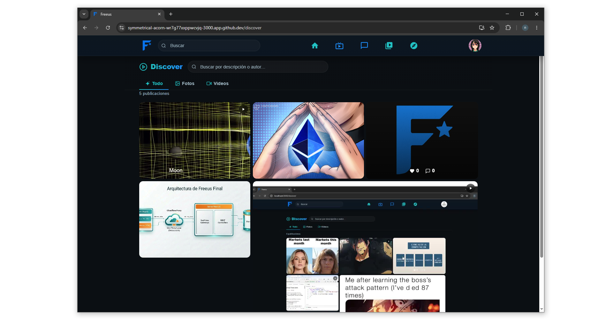
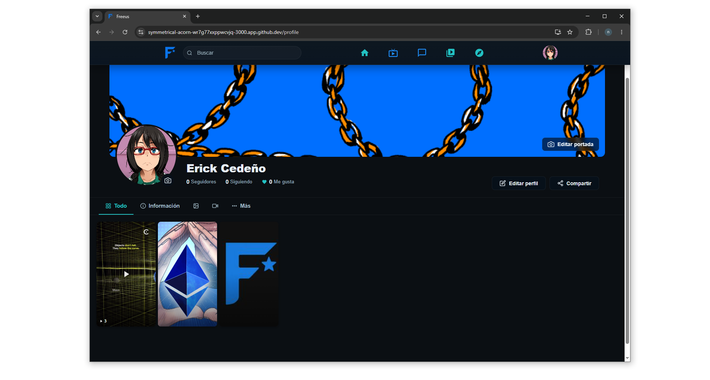
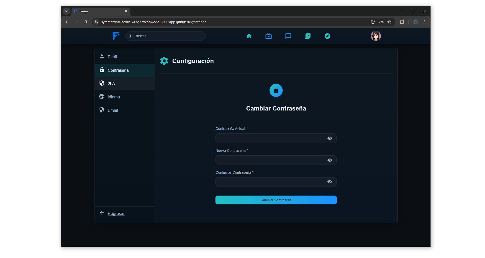
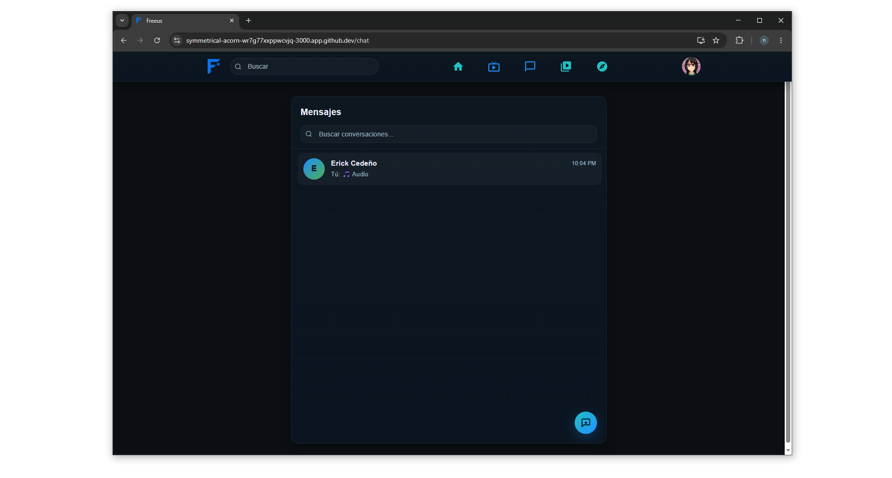
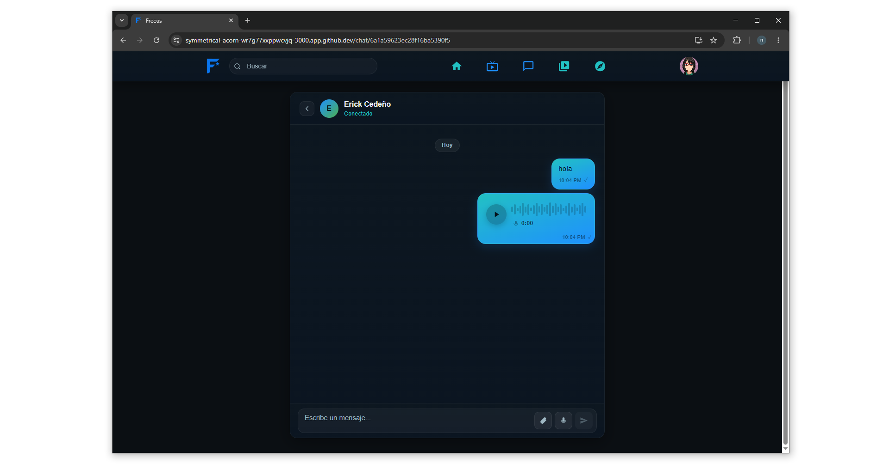

# Freeus

**Freeus** is a censorship-resistant social network built with **NestJS** and **React**. It provides a platform where users can communicate, share multimedia content, and interact without moderators or centralized content control — fostering genuine, unfiltered expression.

---

## 📸 Screenshots

















---

## ⚙️ Technology Stack

[](https://reactjs.org) [](https://nestjs.com) [](https://socket.io) [](https://www.mongodb.com/) [](https://redis.io/) [](https://mui.com)

A concise list of the main technologies used:
- **React** — https://reactjs.org/
- **NestJS** — https://nestjs.com/
- **Socket.IO** — https://socket.io/
- **MongoDB** — https://www.mongodb.com/
- **Redis** — https://redis.io/
- **Material UI (MUI)** — https://mui.com/

These technologies help build a scalable application with real-time capabilities and a modern UI.

---

## 🔧 Prerequisites
- Node.js (recommended: **>= 16**). https://nodejs.org/
- pnpm (recommended): `npm i -g pnpm` https://pnpm.io/
- MongoDB running locally or available in the cloud. https://www.mongodb.com/
- Redis running locally (used for sessions and queues). https://redis.io/

---

## 🚀 Installation & Running

### Docker (recommended)

Start all services (MongoDB, Redis, backend, frontend) with a single command:

```bash
docker-compose up
```

> Ensure Docker and Docker Compose are installed on your system.

### Manual setup
Follow these steps using two terminals (one for backend and one for frontend).

### Backend (`app-core`)
1. Enter the directory:

```bash
cd app-core
```

2. Create a `.env` file with required variables (example):

```env
PORT=4000
DB_URI=mongodb://localhost:27017/freeusdb
REDIS_HOST=127.0.0.1
REDIS_PORT=6379
TOKEN_SECRET=changeme
EXPIRE_IN=604800000
RATE_LIMIT_TTL=60
RATE_LIMIT=10
EMAIL_USER=you@example.com
EMAIL_PASS=yourpassword
```

3. Install dependencies and run in development mode:

```bash
pnpm install
nest start --watch
```

The backend listens by default on `http://localhost:4000` and exposes the API under `/secure/api`.

### Frontend (`frontend`)
1. Enter the directory:

```bash
cd frontend
```

2. Install dependencies and run:

```bash
pnpm install
pnpm start
```

The React app runs by default at `http://localhost:3000`.

> If the backend runs on a different URL, update `frontend/.env` or modify the default in `frontend/src/api/http.js`.

---

## 📝 Notes
- Make sure MongoDB and Redis are running before starting the backend.
- For production, build the backend (`pnpm run build`) and run `pnpm run start:prod` or follow standard deployment best practices.
